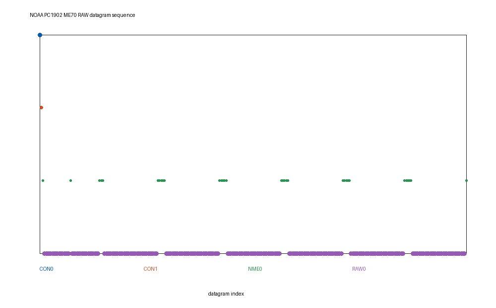
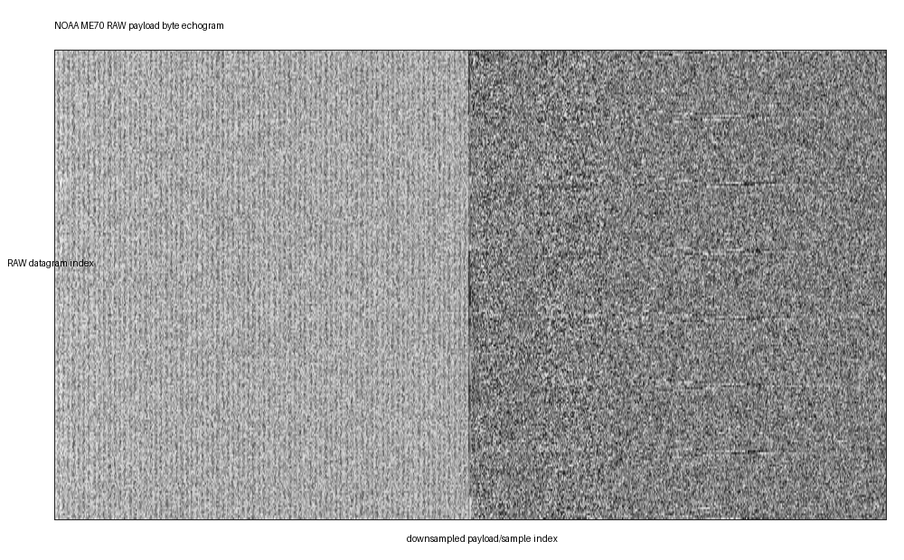
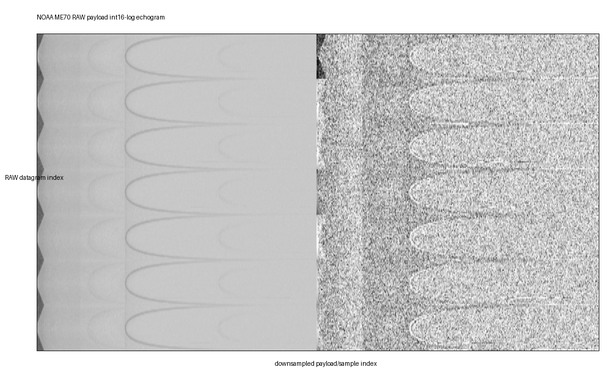
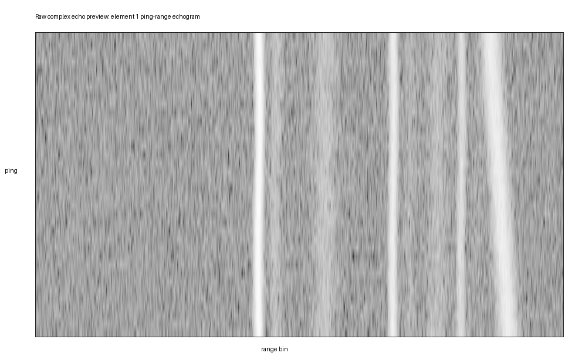
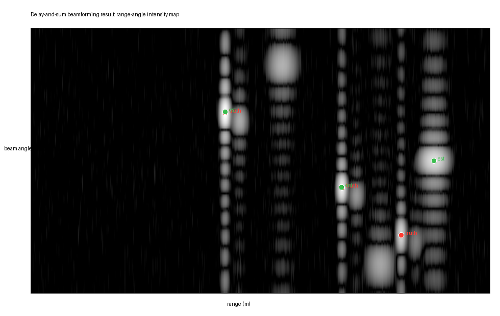
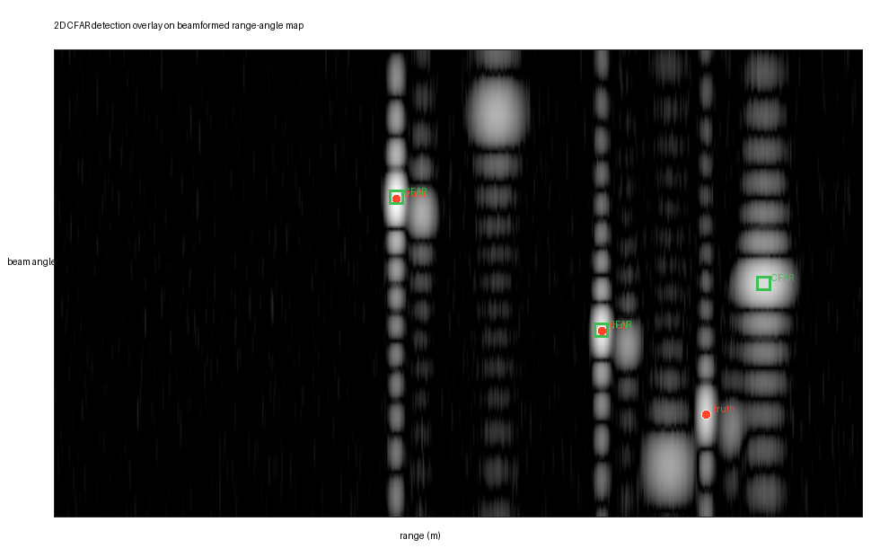
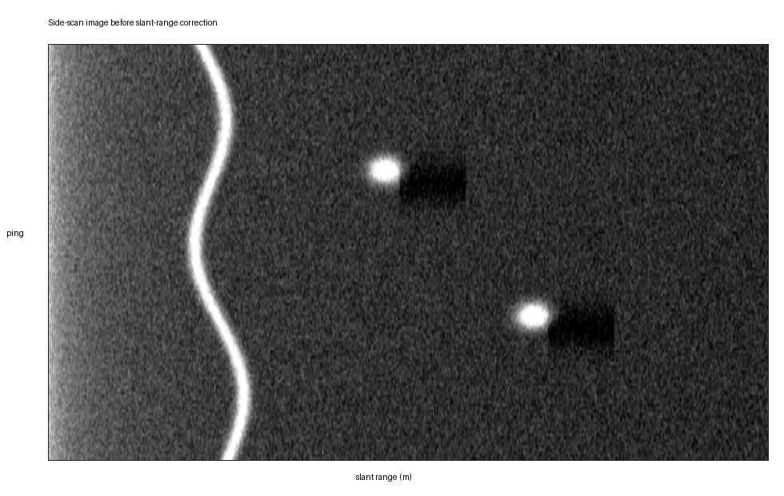
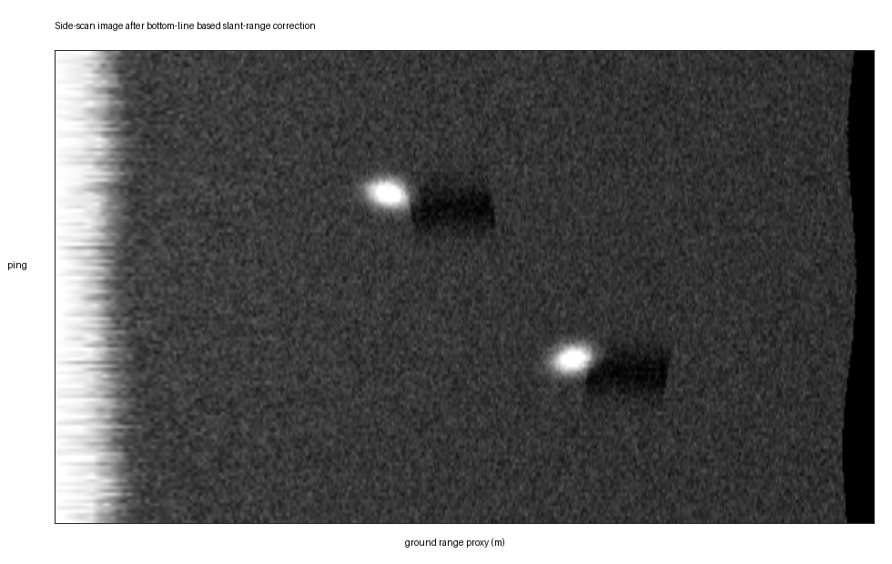
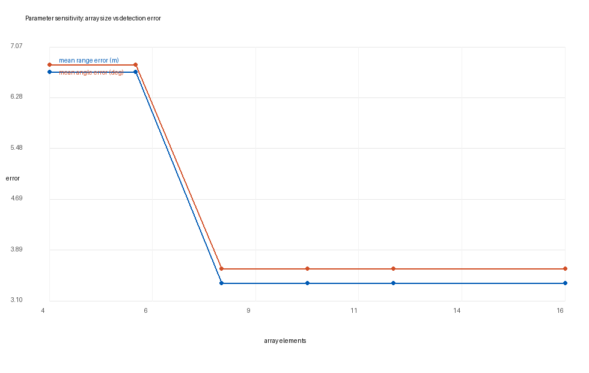

# Sonar Algorithm Validation

面向水声算法工程师岗位的小型项目：结合 **NOAA 真实 ME70 水柱声呐 `.raw` 数据结构解析** 与 **可控单/多波束声呐算法仿真验证**，展示从原始数据认知、算法实现、结果可视化到误差分析的完整训练链路。

> This is an engineering-oriented validation project, not a claim of a new sonar theory or a product-grade calibrated ME70 processor.

## What This Project Does

### 1. Real NOAA ME70 Raw Data Parsing

Data source:

- Dataset: NOAA NCEI Water Column Sonar Data Archive, PC1902 ME70
- DOI: https://doi.org/10.25921/tctw-am57
- Local sample file: `data/real_noaa_me70/PC_2019_-D20190613-T030352.raw`
- Size: about 2.99 MB

Implemented:

- Parse Kongsberg/Simrad RAW datagram framing.
- Identify `CON0`, `CON1`, `NME0`, and `RAW0` datagrams.
- Extract RAW payload previews.
- Generate byte-level and int16-log payload echogram previews.

Current parse result:

| Datagram | Count | Meaning |
|---|---:|---|
| `CON0` | 1 | Configuration record |
| `CON1` | 1 | Configuration/channel-related record |
| `NME0` | 31 | NMEA/navigation text record |
| `RAW0` | 231 | Acoustic raw data record |

### 2. Synthetic Sonar Algorithm Validation

Implemented:

- Generate synthetic multibeam complex raw echoes.
- Simulate non-integer target range/angle, weak target, multipath, clutter, bottom return, and noise.
- Perform delay-and-sum beamforming.
- Generate range-angle intensity map.
- Run 2D CFAR detection.
- Evaluate range/angle error against ground truth.
- Generate synthetic side-scan waterfall.
- Perform bottom-line detection and slant-range correction.
- Run parameter sensitivity tests for noise, sound-speed error, and array size.

## Key Results

### Real ME70 Raw Structure







### Synthetic Algorithm Chain













## Repository Layout

```text
.
├── data/
│   ├── real_noaa_me70/
│   │   ├── PC_2019_-D20190613-T030352.raw
│   │   └── README_PC1902_ME70.md
│   └── synthetic/
│       ├── synthetic_multibeam_raw.npz
│       ├── synthetic_multibeam_metadata.json
│       ├── synthetic_sidescan_waterfall.npz
│       └── synthetic_sidescan_corrected.npz
├── docs/
│   ├── PROJECT_ANALYSIS.md
│   ├── REAL_DATA_REPORT.md
│   └── FULL_ACOUSTIC_PARSING.md
├── results/
│   ├── real_noaa_me70/
│   └── synthetic/
├── src/
│   ├── build_sonar_job_dataset.py
│   ├── enhance_sonar_job_project.py
│   ├── parse_noaa_me70_raw.py
│   └── run_multibeam_demo.m
└── requirements.txt
```

## Run

From the repository root:

```powershell
python .\src\build_sonar_job_dataset.py
python .\src\enhance_sonar_job_project.py
python .\src\parse_noaa_me70_raw.py
```

The original scripts use fixed Windows paths from the local workspace. If you clone this repository elsewhere, adjust the `ROOT` variables near the top of the scripts.

## Current Limitations

The real ME70 part currently validates file structure and RAW payload organization. It does **not** yet provide product-grade calibrated `Sv`/`TS`.

Not fully implemented yet:

- Full `CON0/CON1/RAW0` field parsing.
- Channel/frequency/beam separation.
- True range-axis reconstruction from sample interval and sound speed.
- Power-to-`Sv` calibration.
- `TS` calculation.
- NMEA navigation synchronization.
- Mature-tool cross-validation with Echopype/Echoview/vendor software.

See `docs/FULL_ACOUSTIC_PARSING.md` for the complete physical quantity parsing plan.

## Resume-Friendly Description

基于 NOAA 公开 ME70 水柱声呐原始 `.raw` 数据完成 Kongsberg/Simrad RAW datagram 结构解析，识别 `CON/NMEA/RAW` 等记录类型并生成真实 RAW payload 回波结构预览图；同时构建可控多波束仿真数据，实现 delay-and-sum 波束形成、二维 CFAR 检测、底线检测和斜距校正，并基于真值评估距离/角度误差及参数敏感性。

